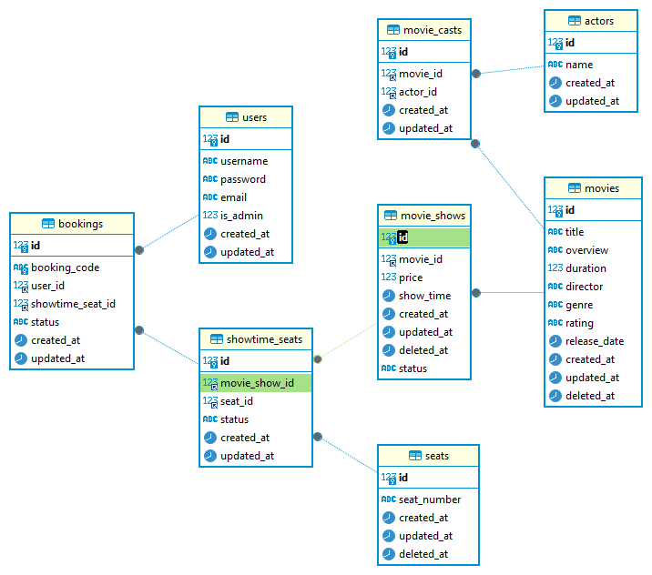

# CinePrime :movie_camera:

---

CinePrime is a web application that allows users to search for movies and TV shows, view details about them, and save them to their watchlist. Users can also view their watchlist and remove items from it. The application uses the OMDb API to search for movies and TV shows.

### How to run the application :runner:

---

##### Prerequisites

- Docker

If you don't have Docker installed, you can download it from [here](https://www.docker.com/products/docker-desktop).

##### Steps

1. Clone the repository.
2. Run the following command to start the application:

```
docker-compose up
```

3. We already provided some seed data for the application. Thus, you can start using the application right away. Don't forget to create a user first.
4. You can use swagger to test the API. The swagger documentation is available at `http://localhost:3000/docs`.
5. Enjoy the application!

### Technologies Used :hammer_and_wrench:

---

- Express.js
- Node.js
- MySQL
- Node Schedule
- JWT

### Scopes and Limitations :mag:

- We only have one theater in our application.
- We can only book tickets for the current day.
- We only show one movie at a time.

### Features :sparkles:

- User can search for movies.
- User can view details about a movie.
- User can book tickets for a movie.
- User can view their booking history.

### Entity Relationship Diagram :bar_chart:

---

The following is the ERD for the application:



We have several tables in our database:

1. Users: Stores information about users.
2. Movies: Stores information about movies.
3. Bookings: Stores information about bookings.
4. Seats: Stores information about seats.
5. Casts: Stores information about casts.
6. MovieCasts: Stores information about the relationship between movies and casts.
   etc.

### API Endpoints and Scheduler :calling:

---

#### Users :busts_in_silhouette:

- POST /user/register: Register a new user.
- POST /user/login: Login a user.

#### Movies :clapper:

- GET /movie/all: Get all movies.
- GET /movie/`:id`: Get a movie by id.
- POST /movie/add: Add a new movie.
- PUT /movie/`:id`: Update a movie by id.
- DELETE /movie/`:id`: Delete a movie by id.
- GET /movies/now-playing: Get the movie that is currently playing.
- POST /movie-showtime/add: Add a new showtime for a movie.
- GET /movie-showtime/`:id`: Get a showtime by id.

#### Bookings :ticket:

- GET /booking/history: Get the booking history of the user.
- POST /booking/add: Book a ticket for a movie.
- PUT /booking/paid/`:id`: Update the payment status of a booking by id.

#### Scheduler :alarm_clock:

Not only do we have API endpoints, but we also have a scheduler that runs every 30 seconds to update expired bookings, update showtime that has passed, and update showtime that is currently playing. The scheduler is implemented using the node-schedule package.

### Future Improvements :rocket:

---

1. Notify users about their upcoming bookings.
2. Allow users to cancel their bookings.
3. Allow users to rate movies.
4. Allow users to view the cast of a movie.
5. Allow users to view the trailer of a movie.
6. Add more theaters and showtimes.
7. Allow users to book more than one ticket at a time.
